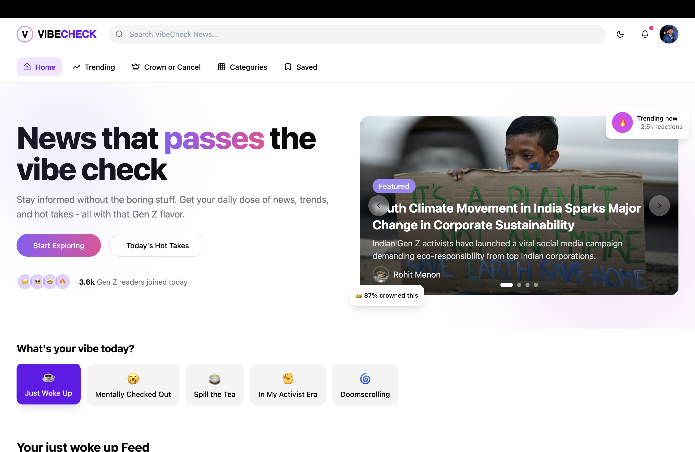
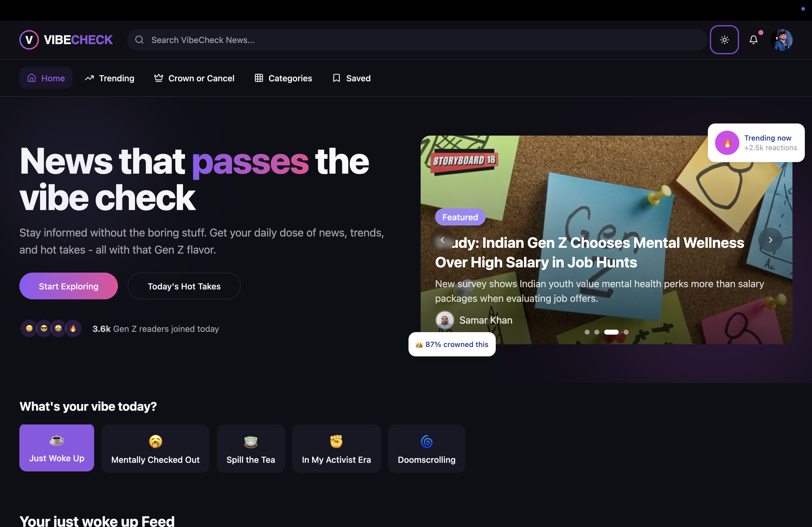
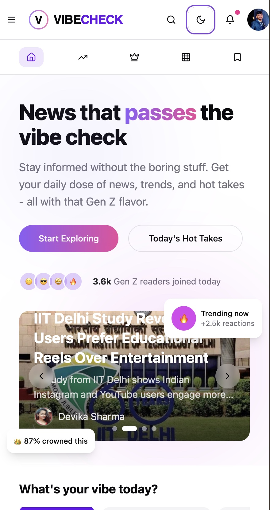
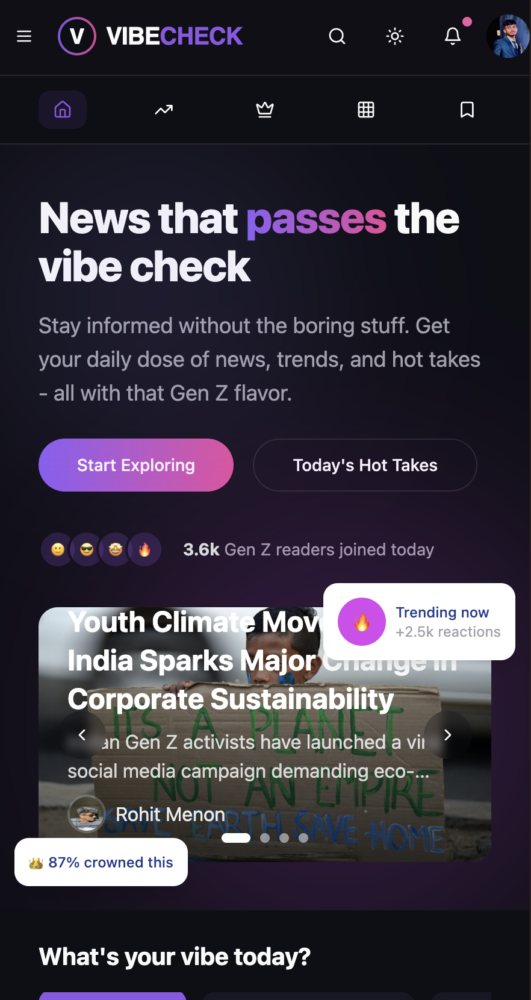

#  VIBE CHECK

#### A modern, Gen-Z-focused news aggregator that delivers trending news with a fresh perspective. Built with React, TypeScript, and Tailwind CSS.

 [Visit Site](https://vibecheck-avishkar.vercel.app/)

## 🌟 Preview

  
  &nbsp;&nbsp;&nbsp;&nbsp;;&nbsp;&nbsp;
  

## 📱 Mobile View 

  
  &nbsp;&nbsp;&nbsp;&nbsp;;&nbsp;&nbsp;
  

## ✨ Features

- 🎯 Mood-based news filtering
- 👑 Crown or Cancel voting system
- 🔥 Trending news section
- 🎨 Dynamic theme switching (light/dark mode)
- 📱 Fully responsive design
- 🔍 Smart search functionality
- 📂 Category-based news browsing
- 🔖 Bookmark favorite articles
- 💜 Vibrant, Gen-Z inspired UI/UX

## 🛠️ Tech Stack

- React + TypeScript
- Tailwind CSS for styling
- Shadcn/ui components
- Framer Motion for animations
- React Router for navigation
- React Query for data management

## 📱 Features Breakdown

### Mood-based News 
Select your current mood and get personalized news content that matches your vibe.

### Crown or Cancel
Vote on trending topics and see what's getting crowned or canceled by the community.

### Categories
Browse news by categories:
- Entertainment 🎭
- Technology 💻
- Fashion 👗
- Environment 🌍
- Sports ⚽
- Politics 🏛️
- Health 🏥
- Education 📚

## 🎨 Theming

The app supports both light and dark modes with a vibrant Gen-Z inspired color palette.

## 📦 Project Structure

- `/src/components` - Reusable UI components
- `/src/pages` - Main page components
- `/src/contexts` - React context providers
- `/src/hooks` - Custom React hooks
- `/src/data` - Data management and services
- `/src/lib` - Utility functions and helpers

## 🚀 Deployment

 [vibecheck-avishkar.vercel.app](https://vibecheck-avishkar.vercel.app/)
